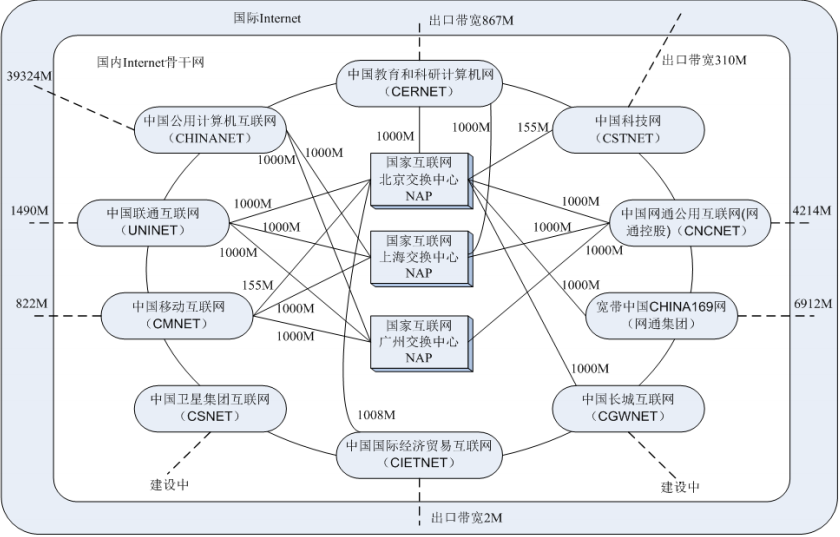

# 计算机网络

## 概述

### 作用

### 重要功能

**连通性**：彼此连通，交换信息

**共享**：信息共享，软硬件共享

### 因特网概述

​	网络通过交换机实现；互联网通过路由器实现

​	多个计算机连接在一起为网络（一般交换机与主机距离不超过100m）

​	多个网络连接在一起为互联网（internet）

​	因特网：全球最大的一个互联网（Internet）

#### 发展阶段

​	

1969：第一个分组交换网，ARPNET

1975：互联网雏形

1983：TCP/IP，互联网标准协议

#### 互联网

**多层次ISP结构的互联网**

**中国互联网**

Internet示意图

因特网标准化

#### 因特网组成

##### 边缘部分

主机之间的通信方式：

 	客户服务器（C/S），对等方式（Peer-to-Peer）

##### 核心部分

数据交换方式：

​	电路交换（Circuit Switching）

​	报文交换（Message Switching）

​	分组交换（Packet Switching）

###### 电路交换

​	电路交换适合于数据量很大的实时性传输；核心路由器之间可以使用电路交换

###### 报文交换

​	报文一般比分组长的多

​	报文交换的时间较长

###### 分组交换

​	将数据进行分组转发，每组数据添加首部，在接受后将首部去除；对于分组转发，中间的转发路径是不固定的

​	通过路由器的存储转发功能，将接受到的分组数据存储，当找到最优路径后，进行数据转发

**优点：高效、灵活、迅速、可靠**

**缺点：时延、开销**

###### 比较

#### 计算机网络中国发展

​	中国在1994年4月20日正式接入互联网

#### 计算机网络类别

​	计算机网络最简单定义：一些互相连接的，自治的计算机的集合

​	按以下不同的方式分类：

**作用范围**

​	广域网（WAN）、城域网（MAN）、局域网（LAN）、个人区域网（PAN）

**使用者**

​	公用网（public network）、专用网（private network）

**拓扑结构**

​	总线型、环形、星型、树形、网状

**交换方式**

​	电路交换网、报文交换网、分组交换网

**工作方式**

​	资源子网、通讯子网、接入网

#### 计算机网络性能

##### 速率

​	连接在计算机网络上的主机在数字信道上传送数据位数的速率，data rate 或 bit rate ；b/s，kb/s，Mb/s，GB/s

##### 带宽

##### 吞吐量

##### 时延

##### 时延带宽积

##### 往返时间

##### 利用率

#### 计算机网络体系结构

## 物理层

## 数据链路层

## 网络层

## 运输层

## 应用层

## 网络安全

## 因特网多媒体服务

## 无线网络

## 下一代因特网

# Appendix

ARPNET（*Advanced Research Projects Agency Network*）

ISP（*Internet Service Provider*）

NAP （*network access point*）

WAN（*Wide Area Network*）

MAN（*Metropolitan Area Network*）

LAN（*Local Area Network*）

PAN（*Personal Area Network*）